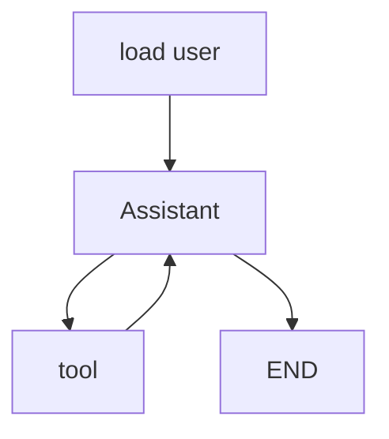
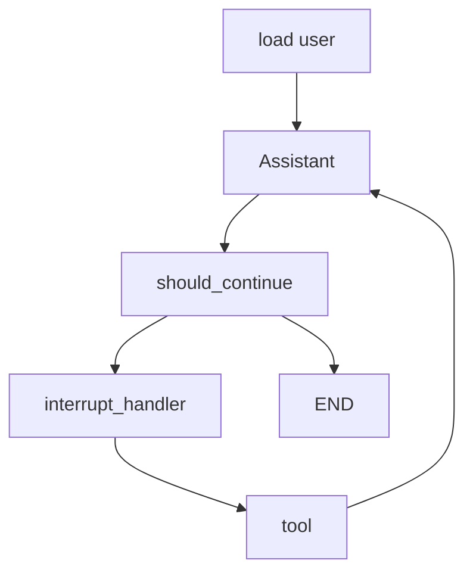

# Agentic Application with Langgraph
An excursion booking agentic application built on langgraph.
uses a AWS agent core runner
but
- uses langgraph short term memory (checkpointer) with an AWS postgres implementation
- uses langgraph long term memory (store) with an AWS postgres implementation
- Uses datadog for observability
- Human in the loop with langgraph interrupts in branch feature/human_in_the_loop

the repo is in tutorial style
- step 1: initial - 101 agent
- step 2: feature/human_in_the_loop - added human in the loop interrupt resume or cancel
  step 3: feature/long_term_memory - added long term memory
- step 4: feature/realy_long_term_memory / master use postgres for store checkpoints and memory store
## Install

```bash
poetry shell
poetry install
cp env.copy .env
```

## Observability with datadog
bring up datadog agent and postgres for stores
```bash
docker-compose up
```

## Run
```bash
poetry run ddtrace-run python langgraph_bedrock.py
```

## Invoke the agent
```bash
curl -X POST http://localhost:8080/invocations \
  -H "Content-Type: application/json" \
  -d '{
        "prompt": "book me an excursion",
        "thread_id": "fc6faede-87f7-4e91-a172-eacd7230d405",
        "user_id": "darthShana"
      }'
```

## Resume after interrupt
Confirm booking
```bash
curl -X POST http://localhost:8080/invocations \
  -H "Content-Type: application/json" \
  -d '{
        "command": "confirm",
        "thread_id": "fc6faede-87f7-4e91-a172-eacd7230d405",
        "user_id": "darthShana"
      }'
```
Abort booking
```bash
curl -X POST http://localhost:8080/invocations \
  -H "Content-Type: application/json" \
  -d '{
        "command": "cancel",
        "thread_id": "fc6faede-87f7-4e91-a172-eacd7230d405",
        "user_id": "darthShana"
      }'
```
Feedback to booking Agent
```bash
curl -X POST http://localhost:8080/invocations \
  -H "Content-Type: application/json" \
  -d '{
        "command": "feedback",
        "feedback": "i have a cold and i dont want to go diving",
        "thread_id": "fc6faede-87f7-4e91-a172-eacd7230d405",
        "user_id": "darthShana"
      }'
```

## Walkthrough

### Agent 101
An agentic application is one with a llm powered controller, that dictates control flow. As apposed to a having this 
dictated by a static business process flow. Lets call llm powered controller the assistant. 
Here our assistant has a set of tools it can call. Its has a system prompt: "book excursions for user", 
it gets given a input "book me an excursion", it then uses these available tools to perform the "job to be done" for the user 

#### Tools
Lets start by defining some tools. I ve got 3 fake tools
1. available_excursions() - Returns a list of available excursions
2. weather() - Gets the current weather
3. book_excursion(excursion) - Books the excursion
In the real world you can add real functionality here to call api, db queries etc.

#### Nodes and Edges (Finite State Machines)
If you let the assistant run wild with the tools, things tend to get unmanageable, this is where [Langgraph](https://www.langchain.com/langgraph) comes in. 
We control the behaviour of the assistant by defining a finite state graph and directing when the llm is called and when tools are called.


To start with we will have this simple graph, then we get a little bit more complicated with

Langgraph will execute one node and then pass execution to the next, as seen in some cases two paths are possible 
and a 'conditional edge' will decide which path to take. In this simple ReAct-style agent the assistant node will 
plan how to get the job done, decide what tool to execute next, the tool node will execute this tool and give control back to the assistant, 
which can use the results to plan the next tool execution or end

#### State and Traces
When we "invoke" the graph, 
```python
response = agent.invoke(
            {
                "messages": [HumanMessage(content=user_input)],
            },
            config={
                "thread_id": thread_id,
                "user_id": user_id,
            }
        )
```
we start a thread (identified by a thread_id) and a run (which has a run_id). A thread is history of what nodes have been 
executed. As a node executes is returns a results, which modifies the state of the thread.
In the case of the "messages" variable in the state the results get appended to the variable, in the case of user_id 
its gets replaced 

#### Short Term Memory (Checkpointer)
Without this a thread would be stateless, one run would finish and the next one would have no idea what happened before
you could invoke
```python
agent.invoke({"messages": [HumanMessage(content="im currently in Thailand")],})
agent.invoke({"messages": [HumanMessage(content="book me an excursion here")],})
```
BUT the agent would have no idea where "here" is, So we can use a checkpointer, Now we can invoke
```python
response = agent.invoke({"messages": [HumanMessage(content="im currently in Thailand")],},
            config={"thread_id": "thread_1"}
        )
response = agent.invoke({"messages": [HumanMessage(content="book me an excursion here")],},
            config={"thread_id": "thread_1"}
        )
```
since we are using the same thread_id (on different runs) it will continue the same thread and have a history previous node invocations and results in the state message history 

#### Execution
by adding
```python
app = BedrockAgentCoreApp()
```
this give us a rest web server, where
```python
@app.entrypoint
def langgraph_bedrock(payload):
```
gets invoked on rest requests, So we invoke the graph here 


#### Observability Invokes and Stream
as you saw we start the app with
```bash
poetry run ddtrace-run
```
then invoke a graph with 
```python 
agent.invoke()
```
we can also stream back results with agent.stream, Langgraph offers several [modes](https://langchain-ai.github.io/langgraph/concepts/streaming/) of streaming back thing as they execute noded, 
tools etc, but we just use invoke for now.
As you can imagine it's super handy to see what nodes have been executed in a thread, what tool calls have been made and what was the result. 
Debugging these app are always about asking: Why did the llm decide to do that? So observability is super important
Here im using [datadog](https://docs.datadoghq.com/llm_observability/quickstart/?tab=python) for this 
you can invoke the graph and on datadog see


### Human In the Loop
Here is where things get a real. If all you need is to invoke tools in sequence where the output of one is mapped to the input of the next, 
you don't really need to use a agent or even a LLM. In fact as a rule of thumb, 
- if you don't need to use a agent, then don't!
- If you don't need to use a LLM, then don't!
However, if you need to provide flexibility because there isn't always a clear definition of what to do next then a 
LLM/agent can make a good decision, But:
#### Interrupts
LLM don't always make good decisions. Also, you don't want the assistant to just book and pay for something on your behalf, 
You always want to confirm a booking before it's locked in. Think "are you sure you want to make this booking?" 
This is where interrupts come in. In the interrupt handler node we do
```python
hitl_tools = [book_excursion.name]

if tool_call["name"] not in hitl_tools:
    # Execute tool without interruption
    goto = "tools"
    continue
else:
    response = interrupt([request])[0]
```
where book_excursion is a "protected" tool, if the tool call is not protected go ahead and do it, if it is then we interrupt the thread and ask the user if we should continue
#### Resume
Once the thread is interrupted, we can resume it say once the user has conformed or cancelled the tool invocation by
```python
response = agent.invoke(
            Command(
                resume=[{"option": user_command, "args": args}]),
                config={
                    "thread_id": thread_id,
                    "user_id": user_id,
                }
        )
```
Invoking the graph (with the same thread id) and using the resume arg, we resume the thread, using args to pass if the user has chosen to confirm or cancel

### Long Term Memory
More things that deliver the value of using a agentic application
#### Memory Store
In [./agent_memory.py](./agent_memory.py) we have some utility memory functions
- get_memory to get memory
- update_memory to upsert memory
In our case a memory is stored against a specific user_id
#### Personalised System Prompts
In my opinion "Long Term Memory" is a poor name for this feature. It should really be called "Personalised System Prompts". 
Which is what this is used for. It allows a user to give feedback to the assistant about what its done and for the 
assistant to remember this feedback so it can make better decisions in the future.
For this specific user, or system-wide. What other application style allows you to do this with this simple user experience? Not many
```python
        special_instructions = get_memory(store, (state['user_id'], "special_instructions"), "No Special Instructions yet")
        

        return {
            "messages": [
                llm_with_tools.invoke(
                    [
                        {"role": "system",
                         "content": agent_system_prompt_hitl_memory.format(tools_prompt=HITL_MEMORY_TOOLS_PROMPT,
                                                                           special_instructions=special_instructions,
                                                                           )}
                    ]
                    + state["messages"]
                )
            ]
        }
```
In this case we simply append the stored feedback into the users memory, and add this to the assistant system prompt as special_instructions.
Managing memory is its own science, in this app i used MEMORY_UPDATE_INSTRUCTIONS which i took from the langgraph 
sample project (See references), to collect special instructions
See [langgraph docs](https://langchain-ai.github.io/langgraph/concepts/memory/#writing-memories) for more options. 
### Really long term memory
This is nice but, until this point ive been using
```python
    checkpointer = MemorySaver()
    store = InMemoryStore()
```
#### What we ned to do in production
To store checkpoints and long term memory. However, in production we need to use something more durable. incomes
```python
conn_pool = ConnectionPool(DB_URI, min_size=1, max_size=10)
store = PostgresStore(conn=conn_pool)
checkpointer = PostgresSaver(conn=conn_pool)
```
that will stick memory and checkpoints in Postgres. I also had to add
```python
        with PostgresStore.from_conn_string(DB_URI) as store_temp:
            store_temp.setup()

        with PostgresSaver.from_conn_string(DB_URI) as checkpointer_temp:
            checkpointer_temp.setup()
```
to setup the schema


## References
[Interrupt Conference](https://github.com/langchain-ai/agents-from-scratch/tree/main) 